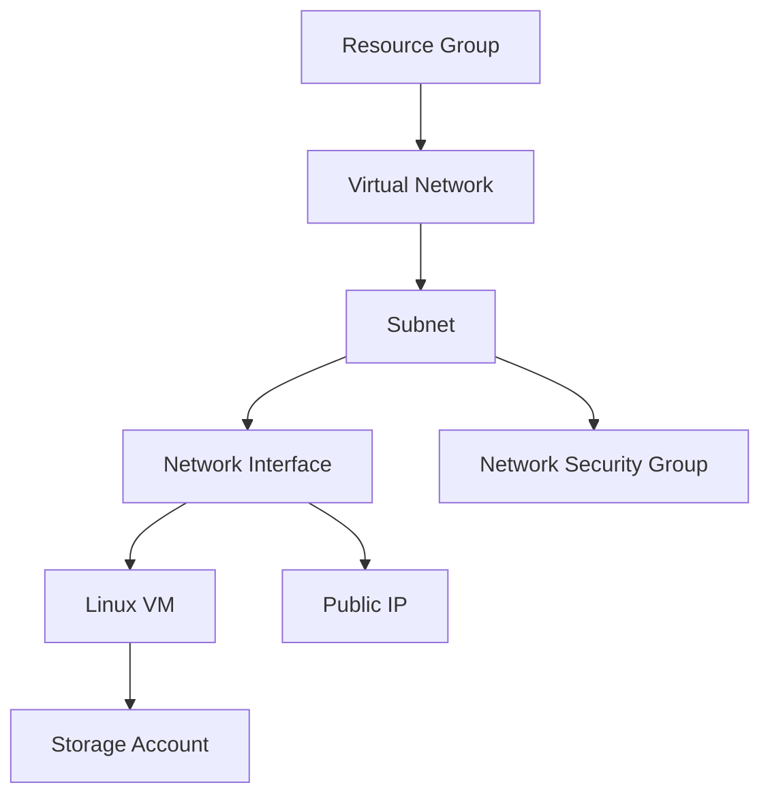

# 🚀 Azure VM Deployment with Terraform


## 📝 Project Overview
Automates deployment of a **production-ready Linux VM** on Azure with:
- Secure SSH access (restricted to your IP)
- Isolated network environment
- Boot diagnostics storage
- Static public IP address

## 📂 File Structure
```
terraform-azure-vm/
├── main.tf        # Core infrastructure resources
├── variables.tf   # Configurable parameters
├── outputs.tf     # Deployment outputs
├── providers.tf   # Azure provider configuration
└── .gitignore     # Secures sensitive files
```

## 🛠️ Quick Deployment

### 1. Clone and Prepare
```bash
git clone https://github.com/inesmrad11/terraform-azure-vm.git
cd terraform-azure-vm
ssh-keygen -t rsa -b 4096 -f ./vm_key
```

### 2. Configure Variables
Create `terraform.tfvars`:
```hcl
subscription_id = "your-azure-subscription-id"  # Get with: az account show --query id
allowed_ssh_ip  = "203.0.113.42/32"            # Your public IP
vm_size         = "Standard_DS1_v2"            # VM instance type
```

### 3. Deploy Infrastructure
```bash
terraform init     # Initialize providers
terraform plan     # Preview changes
terraform apply    # Deploy resources (takes ~5 mins)
```

### 4. Connect to VM
```bash
ssh -i vm_key.pem azureuser@$(terraform output -raw vm_public_ip)
```

## 🏗️ Resource Architecture


## 🔐 Security Configuration
### Mandatory Protections
```hcl
# variables.tf
variable "allowed_ssh_ip" {
  description = "Your public IP in CIDR notation"
  type        = string
  sensitive   = true
  default     = null # Forces explicit definition
}
```

## 📜 .gitignore Essentials
```
*.tfstate
*.tfvars
.terraform/
*.pem
```

## 🧰 Maintenance
| Command              | Purpose                     |
|----------------------|---------------------------|
| `terraform output`   | View deployment outputs   |
| `terraform refresh`  | Sync with cloud state     |
| `terraform destroy`  | Remove all resources      |

## 🚨 Troubleshooting
| Issue                     | Solution                                               |
|---------------------------|--------------------------------------------------------|
| Authorization failed      | Run `az login`                                        |
| SSH connection refused    | Verify NSG rules: `az network nsg show -g MyRG -n MyNSG` |
| Invalid provider          | Run `terraform init -upgrade`                         |

## 📜 License
This project is licensed under the MIT License.

